# Design: Turtle & Penguin Math (working title)

| | |
|---|---|
| Status | v1 design, ready for implementation |
| Requirements | `docs/requirements.md` (requirement IDs `R-…` are referenced below) |
| Mockups | `docs/design/mockups/*.svg` (the source) + `*.png` (renders of the same) |
| Mockup generator | `docs/design/mockups/_src/` (Python; regenerate after token changes) |
| Original brief | `math-app-description.md` (the parent's first description of the app, for intent) |
| Build brief | `cc-develop-handoff.md` (the original Claude Code instructions for M0–M2; historical) |
| Milestone reports | `docs/milestones/M<n>-report.md` |
| Project checkpoint | `progress.md` (status, decisions, Q&A, assumptions, next steps) |
| Last updated | 2026-09-21 |

**For Claude Code:** the mockups show layout, hierarchy and state. They are not pixel specs; the tokens and component specs below are the source of truth. Purple numbered circles in the mockups are **annotations**. They are not UI. Each one is explained in §7 under that screen.

---

## 1. Design principles

1. **Calm by default, playful on success.** Screens are quiet: a warm sand background, white cards, one teal action colour. Colour and motion burst only when the learner gets something right (the penguin) or needs help (the turtle).
2. **The math is the hero.** The number or equation is the largest thing on the screen, set in a math face and centred. Chrome stays small.
3. **Show the process.** Every solved equation leaves a visible trail of steps. Hints refer to *the learner's* numbers.
4. **Never punish.** No red, no buzzers, no timers, no taking anything away. "Not quite" is amber and gentle. Every answered question earns at least one star.
5. **Two characters, two jobs.** The turtle (**Shelly**) means *help*: she is patient and green, and always appears in the help colour. The penguin (**Pip**) means *celebration*: bouncy, with gold stars. They never swap roles. (The names are placeholders. See §4.3: the learner names them on first run.)
6. **Touch first, keyboard complete.** Targets ≥ 48 px. Everything works with a finger, a mouse, or a keyboard.

---

## 2. Design tokens

Implement these as CSS custom properties in `src/ui/theme/tokens.css`, plus a typed mirror in `tokens.ts`. Components use only tokens, never raw hex values.

### 2.1 Colour

All text/background pairs were checked: every pair listed is ≥ 4.5:1 (most are ≥ 5.5:1).

| Token | Light | Dark | Use |
|---|---|---|---|
| `--bg` | `#FBF7EF` | `#0F1B24` | App background (warm sand / deep sea) |
| `--surface` | `#FFFFFF` | `#172733` | Cards, question card, keypad |
| `--surface-sunken` | `#F3ECDD` | `#1E3240` | Progress track, disabled button, keypad operator keys |
| `--line` | `#E4DACA` | `#2C4456` | Card borders, dividers, idle option border |
| `--ink` | `#1B2B3A` | `#E8F1F5` | Primary text, math |
| `--ink-muted` | `#51606E` | `#A6B8C6` | Secondary text, captions |
| `--primary` | `#0B6E6D` | `#5CCBC7` | Primary buttons, selection, progress, links |
| `--on-primary` | `#FFFFFF` | `#0F1B24` | Text on primary |
| `--primary-soft` | `#D5EFEE` | `#123C3F` | Selected option fill, topic chips |
| `--var-bg` / `--var-ink` / `--var-line` | `#D5EFEE` / `#0A5251` / `#0B6E6D` | `#123C3F` / `#A8E6E3` / `#5CCBC7` | **Variable (unknown) term tiles** and the variable key |
| `--const-bg` / `--const-ink` / `--const-line` | `#FCE9CC` / `#7A4410` / `#C9832A` | `#3D2A14` / `#F6D3A1` / `#D9A05B` | **Constant (known) term tiles**; PC topic chip |
| `--help-bg` / `--help-ink` | `#E9F4E4` / `#2F5E24` | `#18301A` / `#BFE3B1` | Turtle hint drawer, walkthrough, step feedback |
| `--turtle` / `--turtle-dark` | `#5E9E4C` / `#3F7432` | same | Turtle art, help borders |
| `--penguin` | `#1E3448` | `#1E3448` (with a light outline in dark mode) | Penguin body |
| `--beak` | `#F28C38` | same | Penguin beak and feet (art only, never text) |
| `--star` | `#F5B301` | same | Stars (art only, never text) |
| `--shell` / `--coral` | `#F4A98A` / `#C2562B` | same / `#F08A61` | Shells; coral used for "down %" emphasis and shell counts |
| `--success` / `--success-soft` | `#237A3A` / `#E3F4E7` | `#7BD88F` / `#15321C` | Accepted step labels, solved line |
| `--amber` / `--amber-soft` | `#9A4A06` / `#FDEBD3` | `#F4B26A` / `#3A2610` | "Not quite" feedback, diagnostic highlights. **The app has no red.** |
| `--parent-bg` / `--parent-nav` | `#F4F6F8` / `#1E3448` | `#0B141B` / `#0B141B` | Parent area (deliberately cooler and more "grown-up") |
| `--annotation` | `#7C3AED` | n/a | Mockups only. Never ship. |

Dark mode follows `prefers-color-scheme` and a parent setting (`auto | light | dark`). Dark mode is not in requirements.md but costs little once everything uses tokens. **SHOULD, v1.1.**

### 2.2 Typography

| Role | Family | Size / line height | Weight | Notes |
|---|---|---|---|---|
| `display` | Nunito | 40 / 48 | 900 | Home greeting, "Assignment done!" |
| `title` | Nunito | 28 / 36 | 900 | Card titles |
| `prompt` | Nunito | 26 / 34 (24 on portrait) | 800 | The question sentence |
| `body` | Nunito | 18 / 28 | 600–700 | Hints, general text |
| `label` | Nunito | 15 / 20 | 800 | Chips, step labels, captions |
| `overline` | Nunito | 14 / 18, +0.06em tracking, uppercase | 900 | "TODAY'S ASSIGNMENT", "STEPS" |
| `button` | Nunito | 20 / 24 (18 small) | 800 | |
| `math-hero` | KaTeX_Main | 64 px | 400 | The question's number (NC, RD, FDP) |
| `math-lg` | KaTeX_Main | 38–44 px | 400 | Options that are fractions; equation lines on the given line |
| `math-md` | KaTeX_Main | 28–30 px | 400 | Step lines, tiles, keypad |
| `money` | Nunito, `font-variant-numeric: tabular-nums` | 34 px | 800 | PC options (money reads better in the UI face than in a math serif) |

- Self-host **Nunito** (variable font, OFL, weights 600–900) and **KaTeX fonts** (bundled with KaTeX). No CDN at runtime (R-PLAT-3).
- Variables are **italic** (KaTeX default). Digits are upright. Use the true minus sign `−`, never a hyphen (R-DISP-1).
- Fractions are stacked with `\frac` (R-DISP-2). The repeating bar is `\overline{24}` (R-DISP-3).
- Minimum learner-facing text size is 15 px. Never go below 13 px anywhere, parent area included.

### 2.3 Spacing, radius, elevation

| Token | Value | Use |
|---|---|---|
| `--space-1…8` | 4, 8, 12, 16, 24, 32, 48, 64 px | 4-pt scale. Card padding = `space-6` (32) desktop, `space-5` (24) tablet |
| `--radius-sm` | 10 px | Constant tiles, inputs, keypad keys (14) |
| `--radius-md` | 16–18 px | Options, buttons, feedback boxes |
| `--radius-lg` | 24–28 px | Main cards, hint drawer |
| `--radius-pill` | 999 px | Variable tiles, chips, counters |
| `--shadow-press` | `0 6px 0 rgba(0,0,0,.08)` inset-bottom "lip" | Buttons and keys get a small bottom lip that compresses 2 px on press (a tactile feel, no drop shadows) |
| `--shadow-lift` | `0 12px 24px rgba(27,43,58,.16)` | Only on a tile being dragged |

### 2.4 Motion

| Token | Value | Use |
|---|---|---|
| `--dur-fast` | 120 ms | Press states, checkbox tick |
| `--dur-base` | 200 ms | Option select, drawer fade, toast |
| `--dur-slow` | 320 ms | Hint drawer slide, tile snap, step line append |
| `--dur-celebrate` | 600–1200 ms | Penguin, stars. Always skippable (R-RWD-5) |
| `--ease-standard` | `cubic-bezier(.2,0,0,1)` | Most transitions |
| `--ease-pop` | `cubic-bezier(.34,1.56,.64,1)` | Stars, tile snap, badge appear (slight overshoot) |

`prefers-reduced-motion` or the parent's "reduce motion" setting (R-NF-3): replace all movement with ≤ 120 ms opacity fades. The balance scale shows a before/after pair of frames. Celebrations become a static star row.

---

## 3. Layout

### 3.1 Breakpoints

| Name | Width | Layout |
|---|---|---|
| `desktop` | ≥ 1200 | Question card max 1152 px, centred. Hint drawer docks right (368 px), and the question card shrinks beside it |
| `tablet-l` | 960–1199 | Same as desktop, 24 px margins. Hint drawer overlays the right 360 px |
| `tablet-p` | 700–959 | Single column. MC options in 2 columns (the 5th spans both). Actions sticky at the bottom. Hint drawer becomes a bottom sheet (max 60% height). Keypad docks below the step lines |
| `< 700` | — | Graceful degradation only (not a target) |

### 3.2 Question screen regions (every topic)

```
┌ TopBar: ‹ Home · topic title · progress (Question n of N) · ★ stars · shells ┐
│ ┌ QuestionCard ──────────────────────────────────────────┐ ┌ HintDrawer ┐ │
│ │ TopicChip (topic · level)                               │ │ (optional) │ │
│ │ Prompt sentence                                         │ │            │ │
│ │ MathHero (the number / equation), caption               │ │            │ │
│ │ AnswerArea (MC grid | select-all | tiles | step lines)  │ │            │ │
│ │ Feedback (toast / step feedback)                        │ │            │ │
│ │ Actions: [Help]  ………………………………………  [Check]            │ │            │ │
│ └─────────────────────────────────────────────────────────┘ └────────────┘ │
└─────────────────────────────────────────────────────────────────────────────┘
```

**Help is always bottom-left and Check always bottom-right**, on every question type (R-HELP-3). Muscle memory matters.

---

## 4. Characters

### 4.1 Shelly the turtle: help

- Appears only in help contexts: the hint drawer, walkthroughs, step feedback, and the Help button icon. Always on `--help-bg`.
- Poses (inline SVG React components, one file per pose, sharing parts): `idle`, `wave` (entering a hint), `think` (H1), `point` (H2, the flipper points at the relevant term), `nod` (walkthrough step accepted).
- Voice: slow, warm, short sentences. She asks more than she tells: "Which terms have an *a*?"

### 4.2 Pip the penguin: celebration

- Appears on correct answers, level-ups, badges, streaks, and the assignment summary. Never in help, and never on a wrong answer.
- Poses: `idle`, `cheer` (flippers up), `hop`, `slide` (belly-slide across for streak milestones), `clap`.
- Voice: excited, very short: "Brilliant!", "Level up!", "5 days in a row!"

### 4.3 Art and naming

- Both characters are **original, simple geometric SVGs** (see the mockups): flat colours, no outlines except the dark-mode rim, round shapes, blush cheeks. Build them as React components with named parts (`<Head>`, `<Flipper side="left">`) so poses are just transforms. Don't use raster images.
- **First-run naming (R-RWD-7):** after the parent sets the PIN, the learner sees both characters and can rename them (defaults "Shelly" and "Pip"). This is a small touch that increases ownership. Store the names in `Settings.mascotNames`.
- Accessories (R-RWD-4): hat, scarf, sunglasses and bow tie as overlay SVG groups anchored to the head.

---

## 5. Components

Names match the intended React components. "States" lists every visual state that needs styling.

| Component | Spec | States |
|---|---|---|
| **TopBar** | 72 px high, `--surface`, bottom border `--line`. Left: `‹ Home` (outlined, 112×44). Title `title`/20. Centre: "Question n of N" label + 340×12 progress track. Right: star counter and shell counter pills (110×40, `--surface-sunken`) | — |
| **TopicChip** | Pill, 30 px high, `label` text. EQ/NC/RD/FDP use `--primary-soft`/`--var-ink`; PC uses `--const-bg`/`--const-ink` | — |
| **MathHero** | KaTeX, `math-hero`, centred, with an optional caption below (`label`, muted), e.g. "the block 24 repeats forever" | — |
| **McOption** | 196×136 (desktop row of 5) or 2-column on portrait. Radius 18. Content centred: `math-lg` or `money` | `idle` (surface, 2 px `--line`) · `hover` (border `--primary` 2 px) · `selected` (`--primary-soft`, 4 px `--primary`, ✓ badge top-right) · `wrong` (sunken fill, 45% veil, ✕ in amber, **disabled**) · `correct` (`--success-soft`, 4 px `--success`) · `focus-visible` (3 px outline `--primary`, 3 px offset) |
| **SetCheckbox** (NC) | 166×132 card: a 30 px checkbox, the set name (`title`/21), and an example line (e.g. "0, 1, 2, …"). The whole card toggles | `off` · `on` (`--primary-soft`, 4 px `--primary`, white ✓ in a filled box) · `flagged` (after the 2nd wrong try: dashed 3 px `--amber` outline, with no hint of which way it's wrong, R-NC-3) |
| **SetsMap** | Nested rounded rectangles: Real ⊃ (Rational ⊃ Integer ⊃ Whole ⊃ Natural) and Irrational beside Rational. The rational chain uses progressively deeper teal tints; Irrational uses the constant tint. Full-size version in a modal; in H3 the current number animates into its innermost box and each enclosing box lights up in turn | `static` · `highlight(set)` |
| **HelpButton** | 200×56, `--help-bg`, 2 px `--turtle`, turtle icon + "Help" | `idle` · `pressed` · `pulsing` (a gentle 2 s glow after the 2nd wrong try, R-HELP-2) |
| **CheckButton** | 176×56 primary | `disabled` (nothing selected yet; `--surface-sunken` fill, `--ink-muted` label, 5.5:1) · `enabled` · `busy` (≤ 100 ms, no spinner needed) |
| **FeedbackToast** | Inline under the answer area (not floating). `--amber-soft` bg, `--amber` text, `body`/17 800. Shows "Not quite." plus an optional **misconception-specific line** (see §9) | `enter` (slide up 8 px + fade, `--dur-base`) · `exit` |
| **HintDrawer** | 368 px, `--help-bg`, 2 px `--turtle`, radius 28. Header: turtle (pose by tier), name, "Hint n of 3", 3 ladder dots. Body: white card with the hint text. Footer: "Show me step by step" (goes to H3), a note "Walkthrough = 1 star, and that's OK!", and Close | `H1` · `H2` · `closed`. Slides in from the right (`--dur-slow`); a bottom sheet on portrait |
| **Walkthrough** | Takes over the question card area, `--help-bg`. Header: turtle + "Let's do it together" + "step k of n" + a segmented progress bar. Body: numbered step lines accumulate (done steps muted, the current step in `--primary`). Supports **inline mini-questions** (3 choice chips) that gate **Next** (R-HELP-4). Supports aligned column arithmetic (e.g. the x-method subtraction) with a highlight band. The final step of EQ walkthroughs is the substitution check | `step(k)` · `awaitingMini` · `done` |
| **StepRail** (EQ) | Vertical list: Move / Simplify / Solve (plus Expand and Clear fractions when relevant, inserted at the top). 188×84 items | `todo` · `active` · `done` (✓, `--success`) |
| **TermTile** | **Variable terms are pill-shaped; constants have 10 px corners.** Shape plus colour, so the meaning survives colour blindness. `math-md`, min 76×64 | `resting` · `dragging` (scale 1.06, `--shadow-lift`) · `ghost` (the dashed outline left where it came from) · `awaitingSign` (shows `?` in place of the sign) · `locked` |
| **DropZone** | Two dashed panels: left "UNKNOWNS (a terms)" (var tint), right "KNOWNS (numbers)" (const tint), with a large `=` between them. A small `⇄ swap` pill under the `=` flips which side is which | `idle` · `dragOver` (solid border, 4% darker fill) |
| **SignPicker** | Pops under a tile that just crossed. Two 58×44 keys, `+` and `−`. Keyboard: `+`/`-` keys | `open` · `wrong` (turtle balance explanation appears; the picker stays) |
| **BalanceScale** | Beam + fulcrum + two pans showing each side's expression. Animation for R-EQ-PED-1: the same term fades in on both pans in coral ("− a"), the beam stays level, then the pans collapse to the shortcut result. Duration ~1.4 s; after 10 correct sign choices, 400 ms (R-EQ-PED-2) | `full` · `short` · `static` (reduced motion) |
| **StepLine** (typed EQ) | 684×64 rows, `--bg`, `math-md`, label right-aligned ("Given", "Expanded ✓", "Moved ✓", "Simplified ✓", "Solved ✓") | `given` · `accepted` · `current` (white, 3 px `--primary`, caret) · `solved` (`--success-soft`) |
| **ErrorMark** | Amber wavy underline under the offending term(s), from the diagnostic's term span | — |
| **StepFeedback** | Under the current line: `--help-bg` box with a small turtle and the diagnostic message (R-EQ, §7.4 table). Title line 19/900, detail 17/700, balance reminder 15 | `hidden` · `shown` |
| **MathKeypad** | 4 columns × 5 rows of 80×64 keys, radius 14, 8 px gap. Digits on `--bg`; operators on `--surface-sunken`; the variable key on `--var-bg`, showing **only this problem's letter**. Row 5: `( ) = ⌫`. Below: `Clear line` + `Check step` | key `idle` · `pressed` (translateY 2 px, lip shrinks) · `disabled` |
| **Celebration** | Pip `cheer` + 3 stars popping in sequence (`--ease-pop`, 80 ms stagger) + confetti rectangles. Text "3 stars! Brilliant!" + "+3 shells". 1-star and 2-star versions are smaller: 1 or 2 stars, Pip `clap` | `3★` · `2★` · `1★` · `levelUp` · `streak` (full screen) |
| **StarCounter / ShellCounter** | Pills. When they increment, the number rolls up and the icon pulses | — |
| **AssignmentCard** (Home) | Overline, title, one row per item (name, n / N, progress bar, ✓ when done), a primary **Keep going ›** button and "x of N done" | `notStarted` ("Start ›") · `inProgress` · `done` |
| **TopicTile** (Home free practice) | 216×136, glyph (math face) + name | `locked` (55% veil + padlock) · `open` · `hover` |
| **Parent: NavRail, StatCard, Sparkline, HintBar, AttentionCard, AssignmentItemRow, Stepper, SegmentedToggle** | See mockups 10 and 11. The parent area uses the same fonts and radii with the cooler `--parent-*` palette, and denser type (`body` 15–17) | — |

---

## 6. Interaction flows

### 6.1 Question lifecycle (all MC / select-all topics)

```mermaid
stateDiagram-v2
  [*] --> Presented
  Presented --> Selected: tap option
  Selected --> Selected: tap other option
  Selected --> Correct: Check ✓
  Selected --> Wrong1: Check ✗ (1st)
  Wrong1 --> Selected: choose again
  Selected --> Wrong2: Check ✗ (2nd)
  Wrong2 --> HintOffered: turtle slides in, Help pulses
  HintOffered --> Selected: dismiss / keep trying
  Presented --> Hint: Help (any time)
  Selected --> Hint: Help
  Hint --> Selected: close hint
  Hint --> Walkthrough: "Show me step by step" / from H2
  Walkthrough --> Correct: finished (1 ★)
  Correct --> Celebrate --> NextQuestion
  NextQuestion --> [*]
```

- A wrong option is disabled after it is checked, so it can't be chosen twice.
- Each later wrong try after the 2nd advances the hint drawer by one tier (R-HELP-2).
- Stars are computed at the end (R-RWD-1). The celebration size follows the stars.

### 6.2 Tile builder (EQ levels 1–2)

1. **Move.** The learner drags a tile across the `=` → the tile lands showing `?` → the SignPicker opens → they tap `+` or `−`.
   - Correct: the tile locks and the BalanceScale plays (full or short).
   - Wrong: the tile shakes, and Shelly shows the balance explanation in the step-feedback box. The learner picks again.
   - When all tiles are on the correct sides, **Done moving** enables, and the "So far:" readout becomes the recorded Separate line.
2. **Simplify.** The unknowns group highlights. A small number pad asks "3*a* − *a* = ? *a*"; the learner enters `2`. Then the knowns: "23 − 3 = ?"; they enter `20`. The tiles merge with a pop.
3. **Solve.** "2*a* = 20. Divide both sides by ?" → the learner enters `2` → "*a* = ?" → they enter `10` → Celebration, including the substitution check line.

Drag mechanics: use pointer events, a 6 px movement threshold, and snap to the nearest zone. Keyboard: Tab to the tile, Enter to pick up, ←/→ to choose the side, Enter to drop (R-EQ-TILE-6). A drag that doesn't cross the `=` just returns the tile (no sign prompt).

### 6.3 Typed steps (EQ levels 3–6)

- The current line is editable. **Check step** (or Enter) runs the step checker.
- Accepted: the line slides up into the history (`--dur-slow`), its label appears with a check, the StepRail advances, and a new empty current line appears.
- Rejected: the ErrorMark goes under the offending term span, StepFeedback shows the diagnostic, and the line stays editable. Two rejections on the same step count as a "wrong try" for hint escalation.
- The keypad's variable key always shows the problem's letter. The physical keyboard maps `*`→×, `-`→−, `/`→fraction slash, and Enter→Check step.

---

## 7. Screens (mockups)

Each mockup is at `docs/design/mockups/NN-name.svg` with a PNG render beside it. Numbers refer to the purple annotation markers.

### 7.1 Home: `01-home.svg`
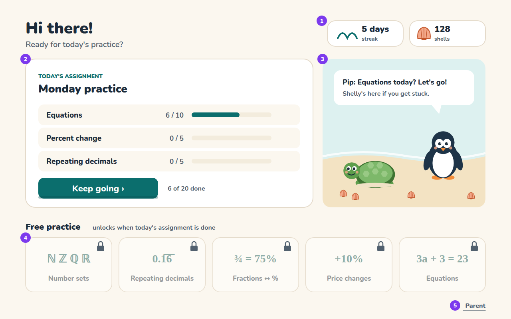
1. **Streak and shells**: counters only. There are no percentages anywhere in the learner UI.
2. **Today's assignment**: one row per item with progress. The primary button resumes exactly where the learner left off (R-SES-5).
3. **Beach scene**: Pip speaks (context-aware line: the topic of the day, or the streak). Shelly sits calmly nearby. Shells scattered on the sand reflect the learner's shell count (up to ~12 visible). Accessories show here when bought.
4. **Free practice** tiles, locked until the assignment is done (R-SES-6 default). When the policy is `always`, there is no veil.
5. **Parent** link: deliberately small, bottom-right, and opens the PIN pad.

### 7.2 Multiple-choice question: `02-question-multiple-choice.svg`
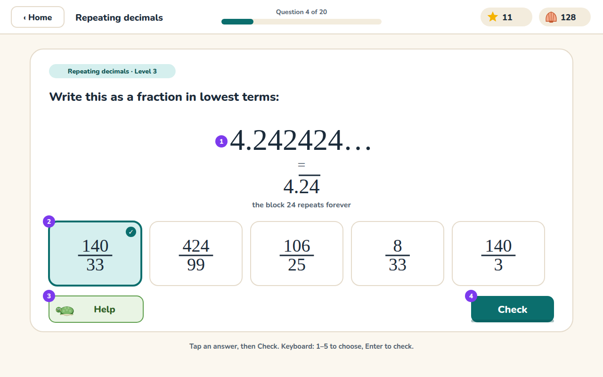
1. **MathHero** at level 3: ellipsis form, then `=` and bar notation, plus the "repeats forever" caption (R-DISP-3).
2. **Five options** in one row; the selected one is shown. Options are built from misconceptions (424/99 = RD-M2, 106/25 = RD-M4, 8/33 = RD-M1, 140/3 = RD-M3). None equals 140/33 (R-ANS-3).
3. **Help** is always bottom-left.
4. **Check** is enabled once an option is selected.

### 7.3 Wrong answer + hint drawer: `03-wrong-answer-hint.svg`
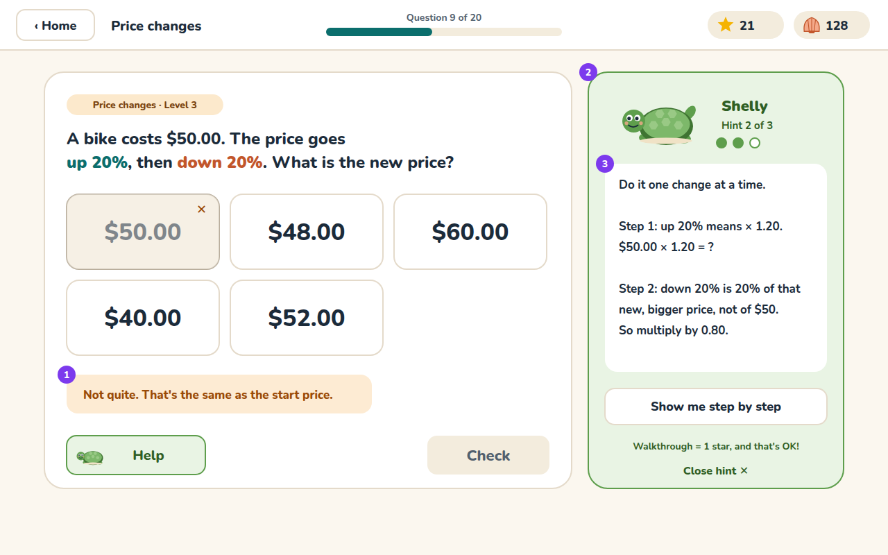
1. **Wrong option** veiled with ✕, plus an inline toast. The toast's second clause is the misconception-specific line for PC-M4 ("That's the same as the start price."), see §9.
2. **Hint drawer**: Shelly in her `wave` pose, "Hint 2 of 3", and the ladder dots.
3. **H2 text** uses this problem's numbers but doesn't compute the final answer. "Show me step by step" opens H3.

### 7.4 Number classification: `04-number-classification.svg`
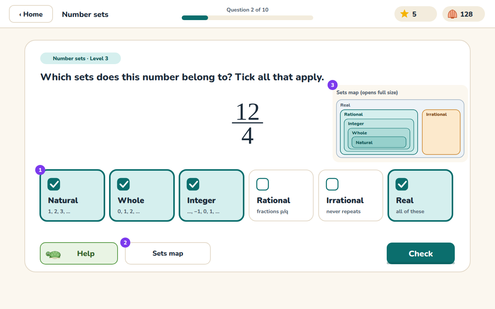
1. **Six set cards**, always in the same order. The state shown is the learner's in-progress answer, with the common "a fraction can't be rational/integer" confusion: Rational is still unticked.
2. **Sets map** button opens the full SetsMap modal (a reference; using it is not a hint).
3. **SetsMap preview** (optional at desktop width; hidden on portrait).

### 7.5 Equation tile builder: `05-equation-tile-builder.svg`
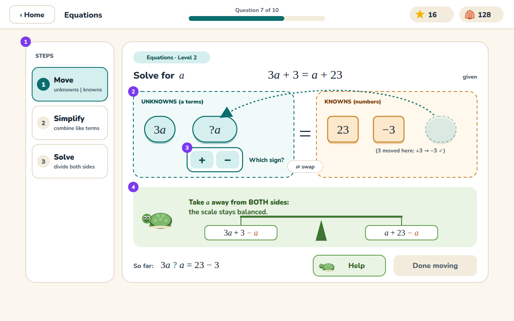
1. **StepRail**: Move is active.
2. **Drop zones**: unknowns on the left, knowns on the right, with the `⇄ swap` pill under the `=`. The `+3` has already crossed and been signed `−3`. The `a` is mid-move (a ghost is left where it started, with a dotted path).
3. **SignPicker** on the arriving tile, which shows `?a`.
4. **BalanceScale** explainer: "Take *a* away from BOTH sides", with `− a` shown in coral on both pans (R-EQ-PED-1). Below it, **So far:** shows the equation the learner is building.

### 7.6 Typed steps: `06-equation-typed-steps.svg`
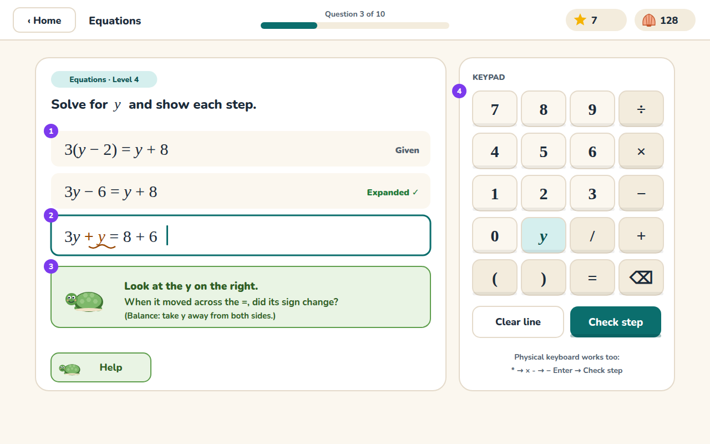
1. **History**: the given line, and the accepted Expand step with its label.
2. **Current line** with a sign error (`3y + y` should be `3y − y`). The amber wavy underline marks the term.
3. **StepFeedback** from diagnostic EQ-D4, including the balance reminder (R-EQ-PED-3).
4. **Keypad**, showing only this problem's variable `y`.

### 7.7 Walkthrough (H3): `07-walkthrough.svg`
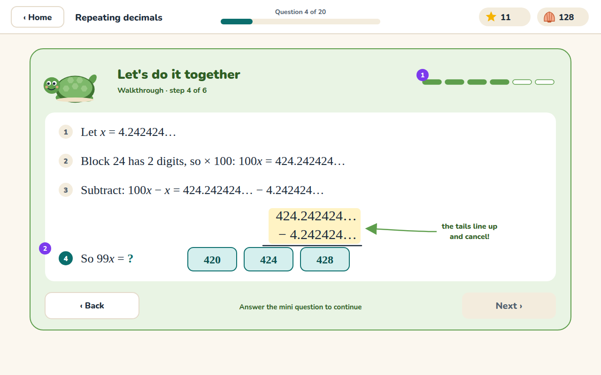
1. **Segmented progress**: step 4 of 6.
2. **Mini-question** gating Next: "So 99x = ?" with options 420 / 424 / 428. Above it, the aligned subtraction with a highlight band shows the repeating tails cancelling.

### 7.8 Correct + celebration: `08-correct-celebration.svg`
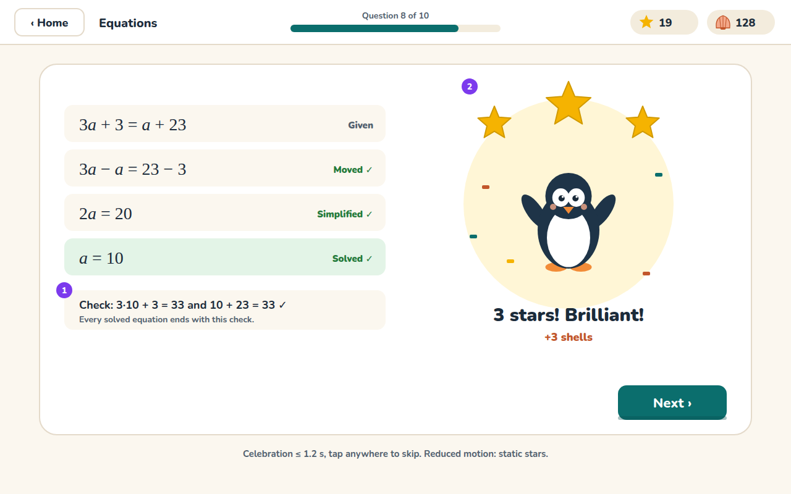
1. **Substitution check** closes every equation (R-EQ hints / §7.6 of requirements).
2. **Pip `cheer`** + 3 stars + confetti. It lasts ≤ 1.2 s, and tapping anywhere skips it. Next is focused automatically.

### 7.9 Assignment complete: `09-assignment-complete.svg`
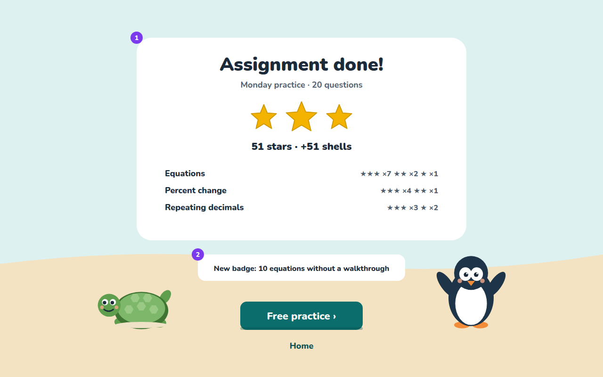
1. **Summary**: stars by topic, as star counts rather than percentages (R-SES-7).
2. **Badge** earned during this assignment, if any.

### 7.10 Parent dashboard: `10-parent-dashboard.svg`
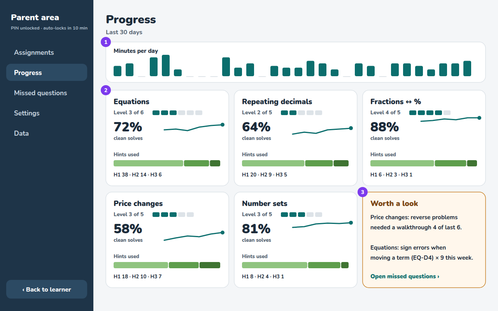
1. **Daily minutes** for the last 30 days (R-PAR-3).
2. **Topic cards**: level pips, clean-solve %, 30-day sparkline, and the hint-tier split bar.
3. **Worth a look**: auto-generated observations. Rules: any topic whose H3 rate in its last 6 attempts is ≥ 50%; any EQ diagnostic code occurring ≥ 5× in 7 days. Links to Missed questions, pre-filtered.

### 7.11 Parent assignment builder: `11-parent-assignment-builder.svg`
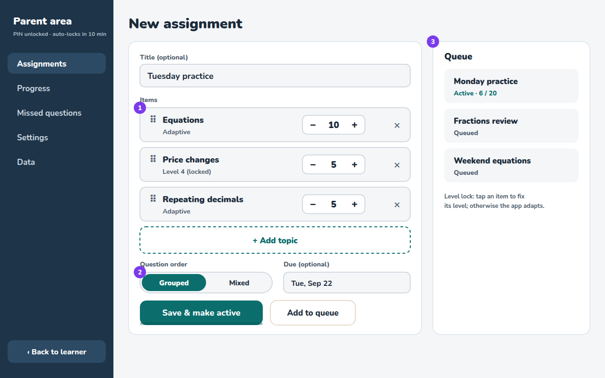
1. **Items**: drag handle to reorder, count stepper, remove. Tapping an item opens a level-lock popover (Adaptive / Level n).
2. **Order** toggle (R-SES-4) and an optional due date.
3. **Queue**: the active assignment plus queued ones, drag to reorder (R-SES-2).

### 7.12 Tablet portrait: `12-tablet-portrait.svg`
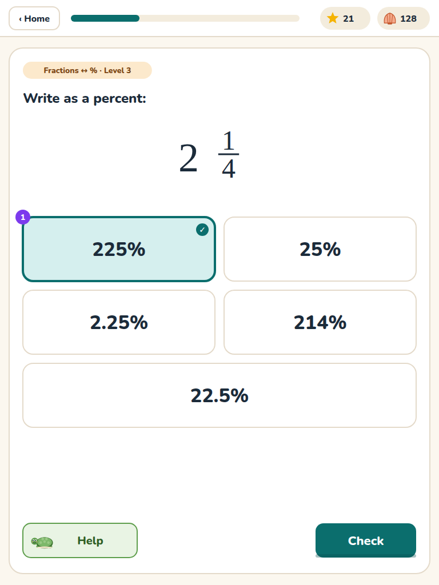
1. **Two-column options**, with the 5th option spanning both columns. Actions are sticky at the bottom of the card. The mixed number is rendered as whole + stacked fraction (R-DISP-2). Options: 225% ✓, 25% (FDP-M7), 2.25% (FDP-M1), 214% (digits juxtaposed), 22.5% (FDP-M1).

**Screens not mocked**, which follow the same patterns: the PIN pad (4 large dots + a 3×4 number pad, reusing MathKeypad keys), first-run setup (PIN, then character naming), Missed-question review (a list on the left, and on the right a replay of the learner's lines including rejected ones with their diagnostic codes, using StepLine + ErrorMark), Settings (a grouped list of toggles and steppers), Data (Export / Import / Reset, each with a confirmation dialog), the badge shelf, and the accessory shop (a grid of accessory cards with shell prices).

---

## 8. Sound (optional, off-able: R-PAR-5)

Short, soft sounds under 300 ms, at a low default volume: `select` (soft tick), `correct` (two-note chime, rising), `stars` (sparkle per star), `notQuite` (a single soft low note, never a buzzer), `tileSnap` (wooden click), `levelUp` (short arpeggio). Ship them as small OGG/MP3 files, preloaded, and play them through a single `AudioContext`.

---

## 9. Copy and tone

All strings live in `src/ui/strings.ts` (R-NF-4).

- **Pip:** "Brilliant!", "Yes!", "Level up!", "3 in a row!", "5-day streak!". Always one line.
- **Shelly:** questions first, then specifics. "Which terms have an *a*?" → "Move the *a* across. What happens to its sign?"
- **Not quite:** always "Not quite." plus at most one gentle, **misconception-specific** clause when the chosen distractor has a code. Examples:
  - PC-M4: "That's the same as the start price."
  - PC-M2: "That's how much it changed. What's the new price?"
  - RD-M2: "Close! Remember to take away the part that doesn't repeat."
  - FDP-M2: "The digits of a fraction aren't its decimal. Try dividing."
  - FDP-M1: "Check which way the decimal point moves."
  - RD-M4: "That decimal stops. This one goes on forever."

  This is R-HELP-1a. The line must never reveal the correct answer.
- Never use "wrong", "incorrect", "fail", or "mistake". Use "not quite", "let's check", "try again".
- Address the learner as "you". Use a name only on Home ("Hi there!", or the learner's name if the parent entered one).

---

## 10. Accessibility checklist

- Contrast: all token pairs in §2.1 are ≥ 4.5:1. Star, beak and shell colours are decorative only and never carry text.
- Colour is never the only signal: tiles differ by shape, wrong options get ✕ and a veil, accepted steps get ✓ and a text label, and flagged set cards get a dashed outline.
- Focus: visible 3 px `--primary` outline with a 3 px offset on every interactive element. Logical tab order: prompt → answers → Help → Check.
- Keyboard: `1–5` choose an MC option; `Space` toggles the focused set card; `Enter` = Check / Check step / Next; `H` opens Help; `Esc` closes the hint drawer.
- Screen readers: KaTeX output includes MathML; add `aria-label`s in words for the hero ("4.242424 repeating, block 24"). Live region for feedback toasts and step feedback.
- Targets ≥ 48×48 px (keypad keys are 80×64).
- Reduced motion per §2.4.

---

## 11. Implementation notes for Claude Code

- Build the tokens first (`tokens.css` + `tokens.ts`), then the primitive components (Button, Card, Chip, MathText via KaTeX, TopBar), then screens in milestone order (requirements §12).
- Mascots: `src/ui/mascots/Turtle.tsx` and `Penguin.tsx` take `pose` and `accessories` props. Use the SVG geometry in `docs/design/mockups/_src/gen.py` (the `turtle()` / `penguin()` functions) as the starting point. It is intentionally simple.
- Animations: use CSS transitions and keyframes for everything except tile dragging and the balance scale. For those, use a small spring (Framer Motion is acceptable if the bundle budget R-NF-2 holds; otherwise hand-written `requestAnimationFrame`).
- Do not ship the purple annotation markers.
- If anything in the mockups conflicts with requirements.md, **requirements.md wins**. Flag the conflict in the PR description.
